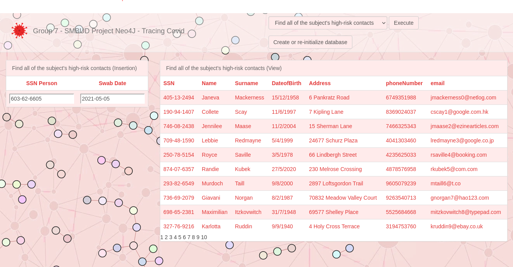

== Covid Tracing Project - Group 7

image::https://github.com/neo4j-examples/movies-javascript-bolt/workflows/Node.js%20CI/badge.svg[CI]

The beta version of the application allows the creation or the re-initializing of the database, the dynamic visualization of the graph, the insertion of a new Swab and to find all the high-risk contacts related to a specific person.

== Quickstart

=== Setup

There some guidelines to execute the web application.

. Install https://neo4j.com/download-center/#community[Neo4j Server]

[source,bash]
----
$ npm install
----

=== Run locally

* Start Neo4j (https://neo4j.com/download[Download & Install]) locally and open the http://localhost:7474[Neo4j Browser].
* Install the Movies dataset with `:play movies`, click the statement, and hit the triangular "Run" button.
* Clone this project from GitHub
* Run the App inside the Webpack Dev Server:

[source,bash]
----
# run in development mode (refreshes the app on source code changes)
$ npm start

# builds the release version with client assets in "build" directory
$ npm run build
----

When running in "dev" mode, navigate to http://localhost:8080/webpack-dev-server/ to see the application.

After executing the `npm run build` command,  open local file "build/index.html" in your browser.

==== Configuration options

[%header,cols=2*]
|===
|Environment variable name
|Default value (or N/A)

|PORT
|8080

|NEO4J_URI
|neo4j+s://demo.neo4jlabs.com

|NEO4J_USER
|neo4j

|NEO4J_PASSWORD
|neo4j

|NEO4J_DATABASE
|neo4j
|===

== Application Overview

The application's elements:

* A combo-box for choice the operation to be performed inside the database
* "Execute" button to execute the selected query
* "Create or re-initialize" button
* Table for queries data insert
* Data Visualization for the second query
* Background visualization of the graph

== Tracing Covid: Get Started

Click on the button to execute the creation queries of the new database or to re-initialize it randomly and the graph will be shown in the background.

== Command & Queries 

Selecting the operation to perform, the page will show the table for the insert of the relative data, after having filled  the fields click on the button
"Execute" to perform the operation.
 
=== Insert a new Swab

Fill the table fields with the data for the new Swab: SSN, Execution Date, Type and Outcome.

Afterwards a message of successful insertion will be shown to the user, otherwise an error message (?).

=== Find all of the subject's high-risk contacts

Find all the contacts refer to the people met during the 48h before a positive swab of a Person.

Fill the table fields (SSN and Swab Date) to find all the high-risk contacts related to that Person.

Then all the data of the contacts identified by the query in the database will be shown. 

. prova
. secondo

